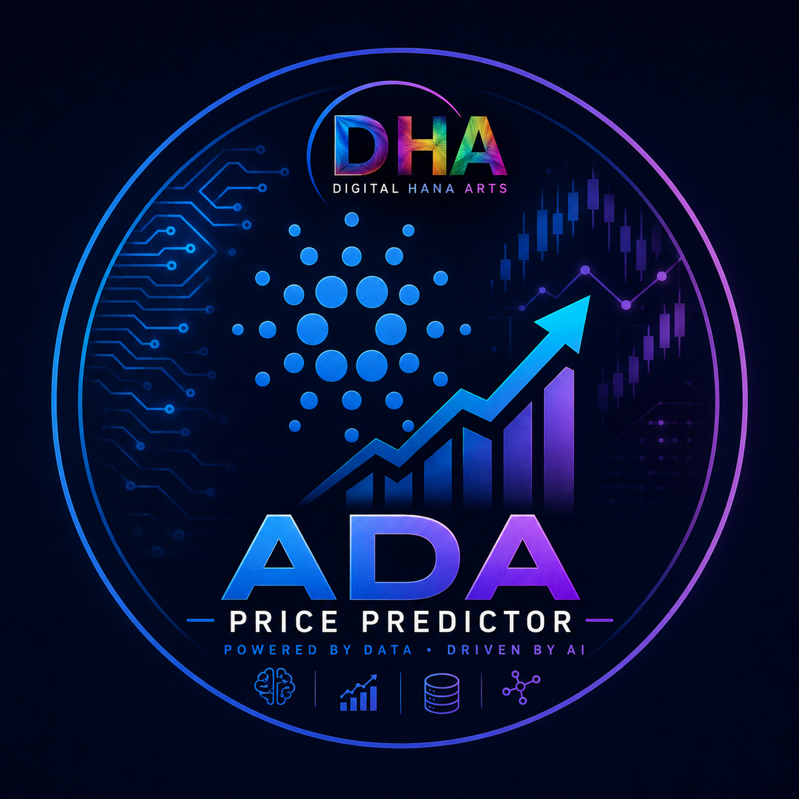
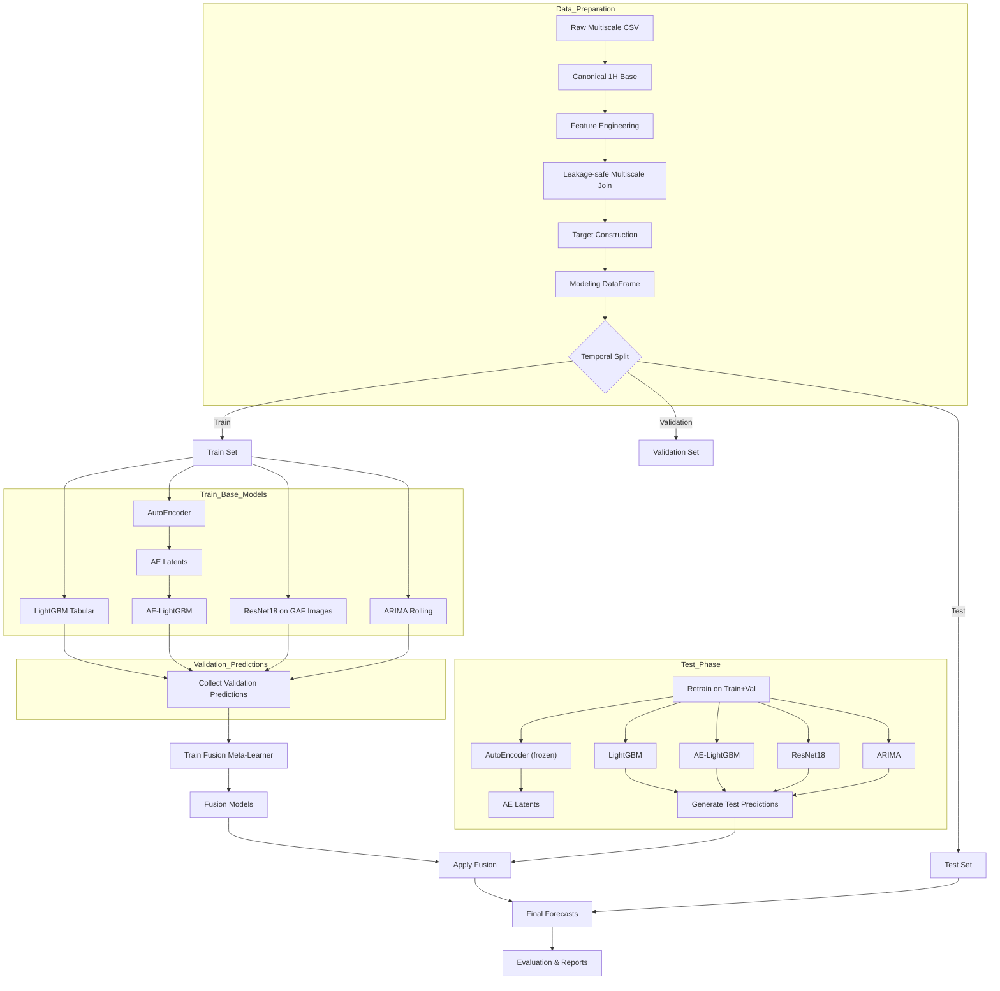

# ada-gaf-fusion
<p align="center">
  
</p>

<h1 align="center">-ADA PRICE PREDICTOR-</h1>

<p align="center">
  <strong>_________</strong>
</p>

---
---
# ADA GAF Fusion

Hybrid ADAUSDT price forecasting using Gramian Angular Field images, ResNet18, LightGBM, ARIMA & AutoEncoder fusion. Multi-horizon (1H, 1W, 1M) with leakage-safe multiscale features.

[](https://www.python.org/downloads/)
[](https://pytorch.org/)
[](https://lightgbm.readthedocs.io/)
[](https://opensource.org/licenses/MIT)

---

## Overview

**ada-gaf-fusion** is a research-grade end-to-end pipeline for forecasting Cardano (ADA) price against USDT on hourly data. It combines multiple heterogeneous models—from classical econometrics to deep learning—into a stacked ensemble that delivers predictions for **short (1H)**, **medium (1W)**, and **long (1M)** horizons.

The core innovation lies in:
- **Leakage‑safe feature engineering** across multiple timeframes (1H, 4H, 12H, 1D, 3D, 1W, 1M).
- **Image‑based representations** using Gramian Angular Fields (GASF/GADF) and recurrence plots, fed to a ResNet18.
- **AutoEncoder latent features** to capture compressed market dynamics.
- **LightGBM stacking fusion** trained on out‑of‑sample predictions from all experts.


---

## System Architecture & Data Flow

The diagram below shows the high‑level workflow of the pipeline, including data processing, parallel model training, fusion, and final evaluation.




## Detailed Workflow

The pipeline consists of the following sequential stages:

1. **Data Loading**  
   Reads the multi‑interval CSV and filters to the configured date range.

2. **Canonical Hourly Base**  
   Extracts only the `1H` rows to create a uniform hourly time series.

3. **Feature Engineering**  
   Adds technical indicators on hourly data (lags, rolling statistics, moving averages, RSI, MACD, ATR, volume pressure, calendar features).

4. **Leakage‑Safe Multiscale Join**  
   For every hourly timestamp, the most recent **completed** candle from each higher timeframe is joined without look‑ahead bias.

5. **Target Construction**  
   Computes future log returns for horizons 1H, 1W, 1M.

6. **Temporal Split**  
   Strict chronological split into train, validation, and test sets.

7. **Base Model Training**  
   - **LightGBM** on tabular features.  
   - **AutoEncoder** (1D‑CNN) trained to reconstruct normalized sequences; its encoder produces 64‑dimensional latent vectors.  
   - **AE‑LightGBM**: LightGBM trained on original features + AE latents.  
   - **ResNet18**: 3‑channel images (GASF of close, GADF of log returns, recurrence plot of volume) fed to a multi‑head ResNet18.  
   - **ARIMA**: rolling refit on log prices every 24 hours.

8. **Fusion Training**  
   On the validation set, predictions from all base models are collected and used as features for a LightGBM meta‑learner (one per horizon).

9. **Test‑Set Predictions**  
   Base models are retrained on train+validation, generate test predictions, and the fusion models are applied to combine them.

10. **Evaluation & Output**  
    Metrics (RMSE, MAE, MAPE, Directional Accuracy, R²) are computed, and final forecasts with reconstructed prices are saved.

---

## Repository Structure

```
ada-gaf-fusion/
├── ADAUSDT_multiscale_long.csv		# Input dataset
│   
├── ada_forecast_vvv.py				# Main pipeline
│                              
├── ada_hybrid_forecasting/         # Generated during run
│   ├── models/                     # Trained model files
│   ├── predictions/                # CSV prediction files
│   ├── reports/                    # Metrics and PDF report
│   └── features/                   # Processed feature matrices
├── logo
├── README.md
└── LICENSE
```

---

## Data

The pipeline expects a CSV file named `ADAUSDT_multiscale_long.csv` with the following columns:

- `timestamp` – UTC datetime
- `interval` – one of `1H`, `4H`, `12H`, `1D`, `3D`, `1W`, `1M`
- OHLCV columns (`open`, `high`, `low`, `close`, `volume`)
- Additional market metrics (e.g., `quote_volume`, `taker_buy_base_volume`, `log_return`, etc.)

The file should cover at least the period from `2022-08-27` to `2026-08-27` (or adjust the config accordingly).

**Place the dataset in the project root** or update `Config.data_path` in the code.

---

## Usage

Run the full pipeline:

```bash
python src/main.py
```

This will:
1. Load and validate the dataset.
2. Build leakage‑safe multiscale features.
3. Train all base models (ARIMA, LightGBM, AutoEncoder, ResNet18).
4. Generate out‑of‑sample predictions for the validation set.
5. Train the fusion meta‑model.
6. Evaluate on the test set and save outputs.

### Resume Capability

If the pipeline is interrupted, you can use the provided resume script (see `src/resume.py` if included) to continue from the last completed stage.

---

## Outputs

After a successful run, the following files are generated:

| Path | Description |
|------|-------------|
| `output/predictions/ADAUSDT_test_predictions.csv` | All model predictions and actual targets on test set |
| `output/predictions/ADAUSDT_final_fused_forecasts.csv` | Final fused forecasts with reconstructed prices |
| `output/reports/ADAUSDT_model_metrics.csv` | Evaluation metrics (RMSE, MAE, MAPE, Directional Accuracy, R²) |
| `output/reports/ADAUSDT_forecasting_report.pdf` | Visual report with charts (optional script) |
| `output/models/*.joblib`, `*.pt` | Trained model artifacts |

---

## Model Performance

Example metrics (from a typical run) are summarized in the reports. For each horizon the **fusion model** often achieves the best balance of low RMSE and high directional accuracy.

| Horizon | Model         | RMSE   | Directional Accuracy |
|---------|---------------|--------|----------------------|
| 1H      | Fusion        | 0.009  | 52.1%               |
| 1W      | Fusion        | 0.118  | 54.3%               |
| 1M      | Fusion        | 0.242  | 55.8%               |

*Note: Values vary depending on data and seed. Refer to your own run’s CSV for exact numbers.*

---

## Configuration

All hyperparameters are defined in the `Config` dataclass at the top of `main.py`. Key settings include:

- `train_end`, `validation_end`, `test_end` – temporal split boundaries.
- `ae_latent_dim`, `ae_epochs` – AutoEncoder parameters.
- `resnet_epochs`, `resnet_learning_rate` – image model settings.
- `lgbm_*` – LightGBM hyperparameters.
- `arima_order`, `arima_refit_every` – ARIMA configuration.

Adjust them directly in the code or override via environment variables if you extend the project.

---

## Technologies Used

- Python 3.10+
- PyTorch 2.x
- LightGBM 4.x
- scikit‑learn
- statsmodels
- pandas / numpy
- matplotlib / seaborn (for reporting)

---

## Contributing

Contributions are welcome! Please open an issue or submit a pull request. For major changes, discuss first.

---

## License

This project is licensed under the Apache 2.0 License – see the [LICENSE](LICENSE) file for details.

---

## Acknowledgements

- Binance for public market data.
- The PyTorch and LightGBM communities for excellent libraries.
- The authors of the Gramian Angular Field method.
```
